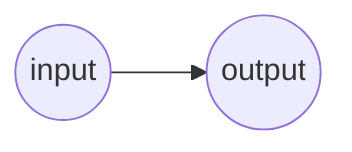

# Single Layer Perceptron (SLP)
## Simplest Possible Neural Network from Scratch

> A Single Layer Perceptron (SLP) is a feed-forward neural network made up of only two layers the input and output layer. "Single Layer" may seem deceiving, but it is considered single as there is only one vector of weight(s).

### Setup Workspace
1. Install Lua from https://www.lua.org/download.html
2. Execute the below command in this workspace to run the example

```sh
  lua main.lua
```

### Explanation
**TODO...**

<br>
<p align="center">
  <i>Figure 1. Diagram of the Simplest Possible Neural Network</i>
</p>

### Why Lua?
Lua is an extremely basic language, making it very easy to understand, even with a topic like machine learning.
